# 🎓 University App - Your Smart Academic Companion

**University App** is a comprehensive Android application designed to assist students in their daily academic life. From finding the perfect university to managing lecture schedules and calculating GPA, this app integrates modern Android development practices to provide a seamless user experience.

The app leverages **Artificial Intelligence (Gemini)** to act as a personal academic advisor.

---

## 📱 App Screenshots

| | | |
|:---:|:---:|:---:|
| 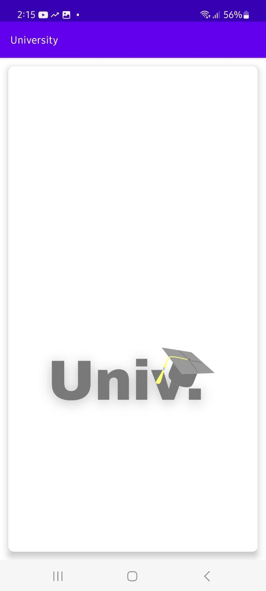 | 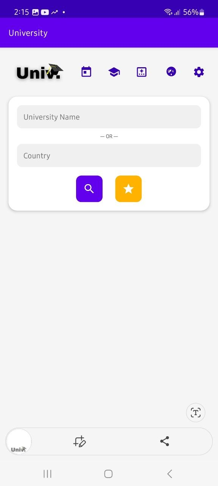 | 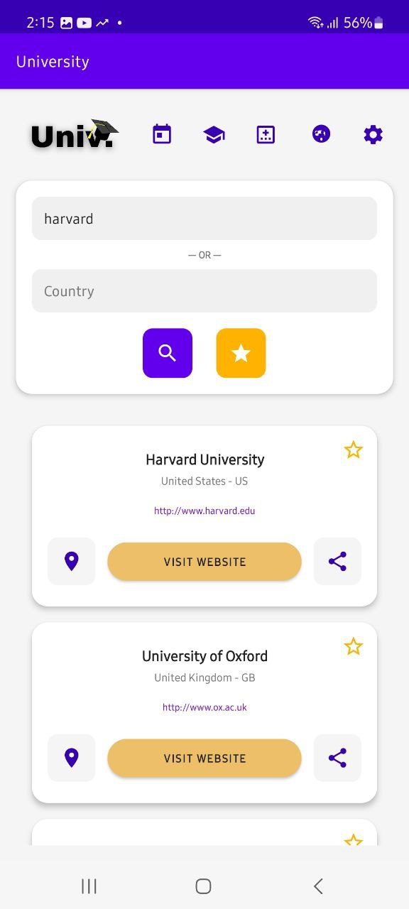 |
| 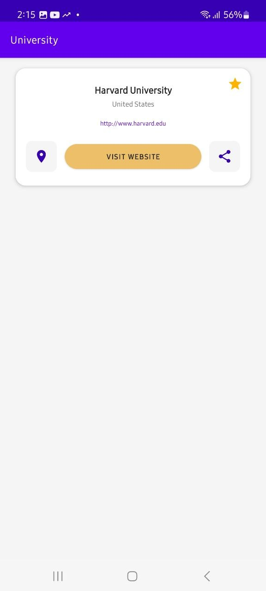 | 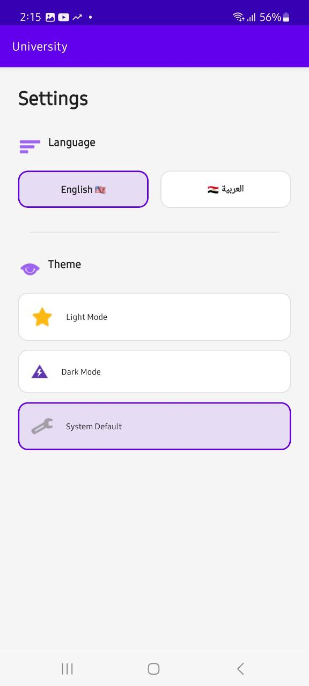 | 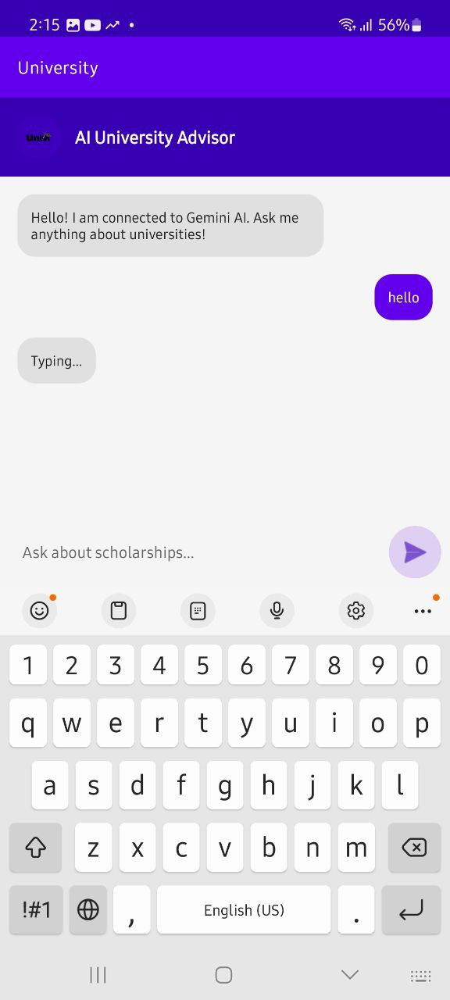 |
| 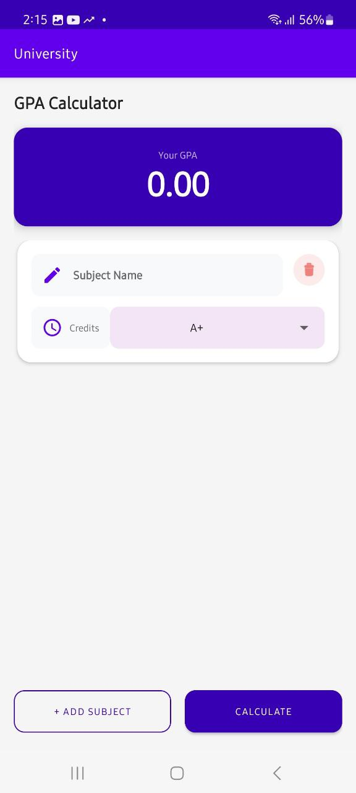 |  | 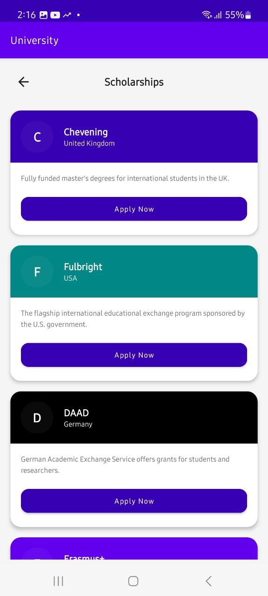 |
| 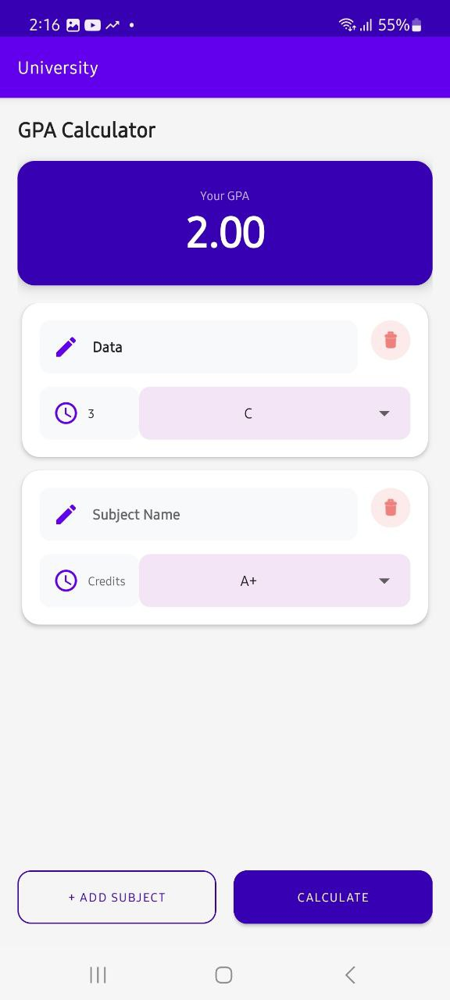 | 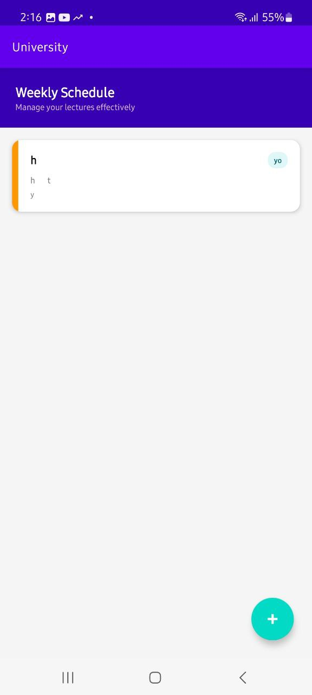 | 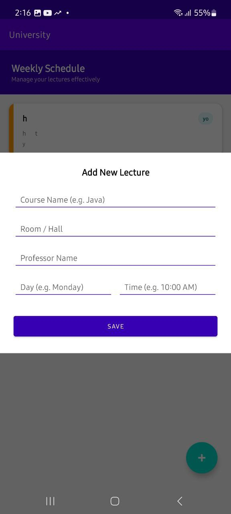 |
| 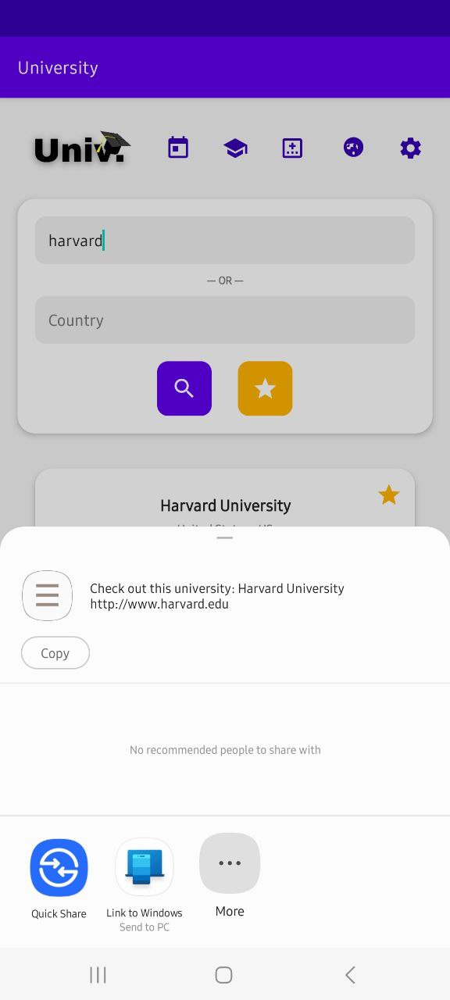 | 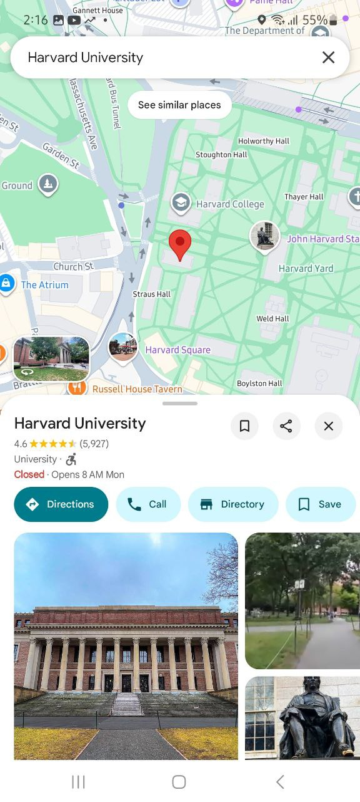 | 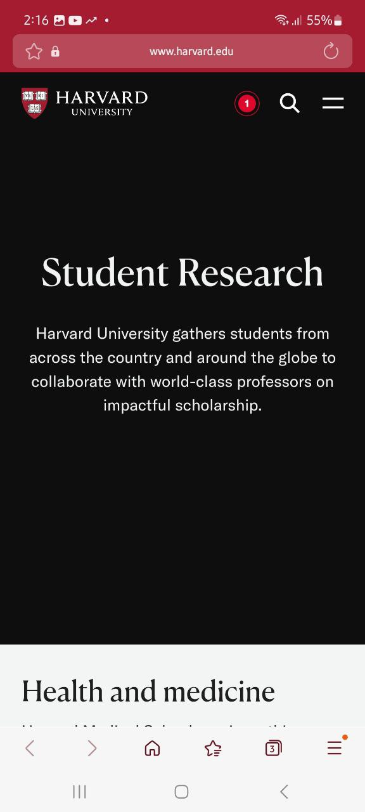 |

---

## 🛠 Tech Stack & Architecture

This project is built using **Native Android (Java)** following the **MVVM (Model-View-ViewModel)** architecture pattern to ensure separation of concerns and testability.

### 🚀 Key Technologies Used

| Technology | Where it is used? | Why it was used? |
| :--- | :--- | :--- |
| **Java** | Entire Application | The core language for Android development used in this project. |
| **MVVM Architecture** | Project Structure | To separate UI logic from business logic, making the code cleaner and easier to maintain. |
| **Room Database** | Lecture Schedule & Favorites | To cache data locally (offline support). Used for saving favorite universities and managing the student's weekly schedule efficiently. |
| **Retrofit 2** | University Search | To handle API requests to *Hipolabs* for fetching university data. Chosen for its speed and type safety. |
| **OkHttp 3** | AI Chat (Gemini) | Used to establish a connection with Google's **Gemini API** for the AI Advisor feature, handling timeouts and JSON bodies manually for flexibility. |
| **Gemini AI API** | Chat Module | To provide intelligent, context-aware responses to student inquiries (e.g., "How to get a scholarship?"). |
| **LiveData & ViewModel** | UI Updates | To observe data changes and update the UI automatically without memory leaks (Lifecycle-aware). |
| **Lottie Animations** | Loading Screens | To provide a modern and engaging user experience during data fetching or empty states. |
| **CardView & Recycler** | Lists Display | Used extensively to display lists of universities, chat messages, and schedule items in a material design layout. |

---

## 💡 How It Works (Modules)

### 1. 🔍 University Search
* Users can search for universities by name or country.
* Data is fetched in real-time using **Retrofit**.
* Users can click on a card to visit the official website.

### 2. 🤖 AI Advisor (Gemini Integration)
* A chat interface allowing students to ask questions.
* Powered by Google's **Gemini Flash Model**.
* Features a "Typing..." indicator and robust error handling.

### 3. 📅 Lecture Schedule (Offline)
* A fully functional CRUD (Create, Read, Update, Delete) module.
* Uses **Room Database** to save lectures permanently.
* Users can add course name, time, professor, and room number.

### 4. 🎓 Scholarships & GPA
* **Scholarships:** A curated list of top global scholarships (Chevening, DAAD, etc.) with direct application links.
* **GPA Calculator:** A tool to calculate semester GPA by inputting subject hours and grades.

---

## 👨‍💻 Developed By

**[Eslam Ali]**
* Android Developer
* [eslameng776@gmail.com]

---
