# 🎓 University App - Your Smart Academic Companion

 

**University App** is a comprehensive, native Android application meticulously designed to assist students in their daily academic life. From exploring global universities to managing weekly lecture schedules, tracking absences, and calculating GPA, this app serves as an all-in-one student hub. It even features an integrated **Artificial Intelligence (Gemini)** assistant to act as a 24/7 personal academic advisor and a smart notes summarizer.

---

## 🎯 The Problem It Solves

University students often struggle with disorganization, relying on multiple fragmented apps to manage their academic life. 
* They use a browser to find scholarships and universities.
* A notepad or gallery image to check their lecture schedule.
* They easily lose track of their absences, risking course disqualification.
* They spend hours trying to manually summarize lengthy lecture notes.
* A separate calculator or website to compute their GPA.

**The Solution:** This application aggregates all these essential tools into a single, cohesive, and user-friendly platform, saving time, preventing academic penalties, and boosting overall productivity.

---

## 📱 App Screenshots

Here is a glimpse of the app's clean and modern UI, fully supporting both Light and Dark modes:

| | | |
|:---:|:---:|:---:|
| 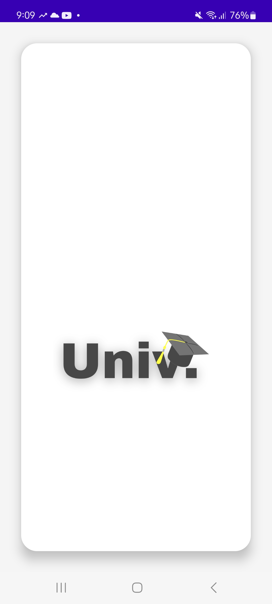 | 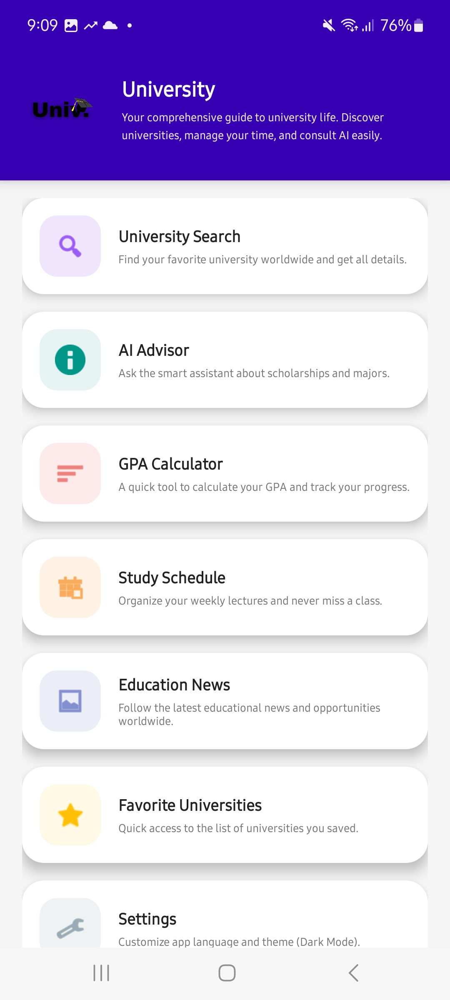 | 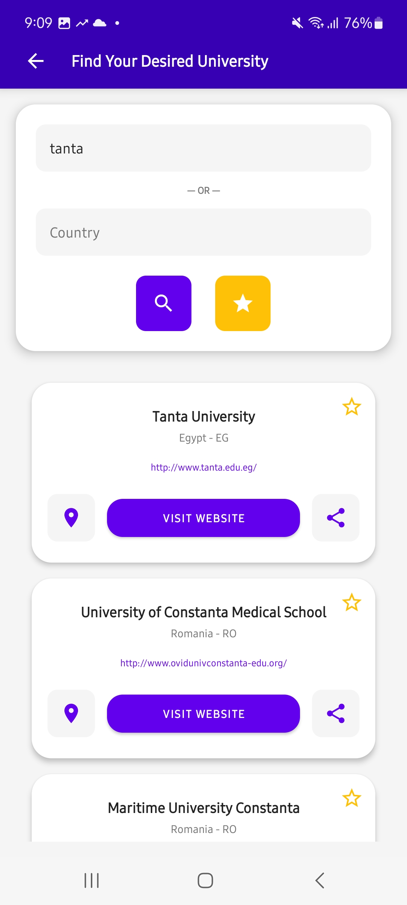 |
| 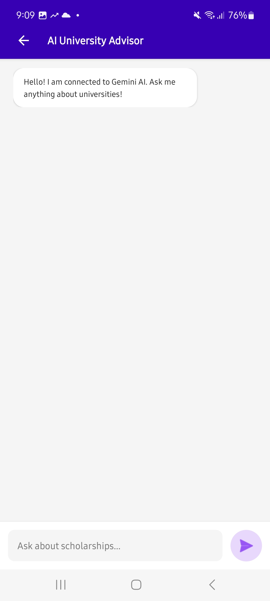 | 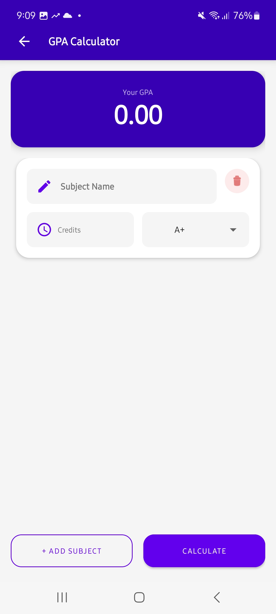 | 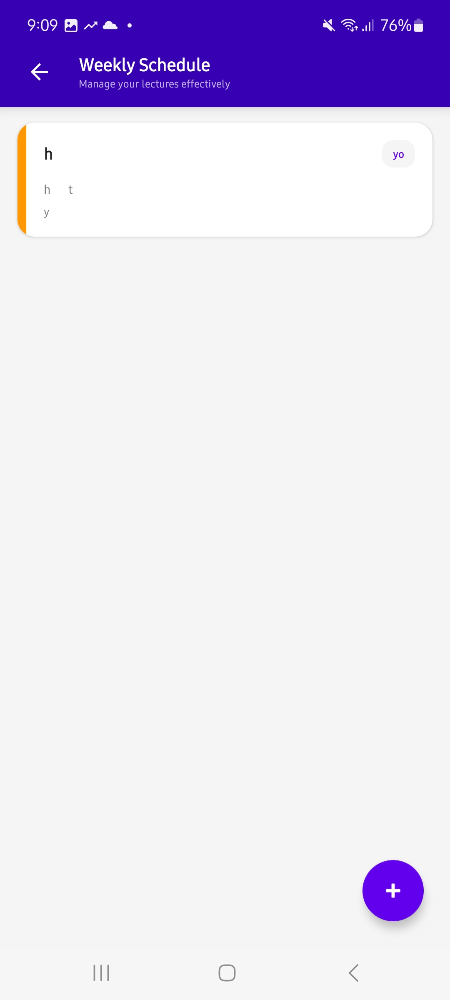 |
| 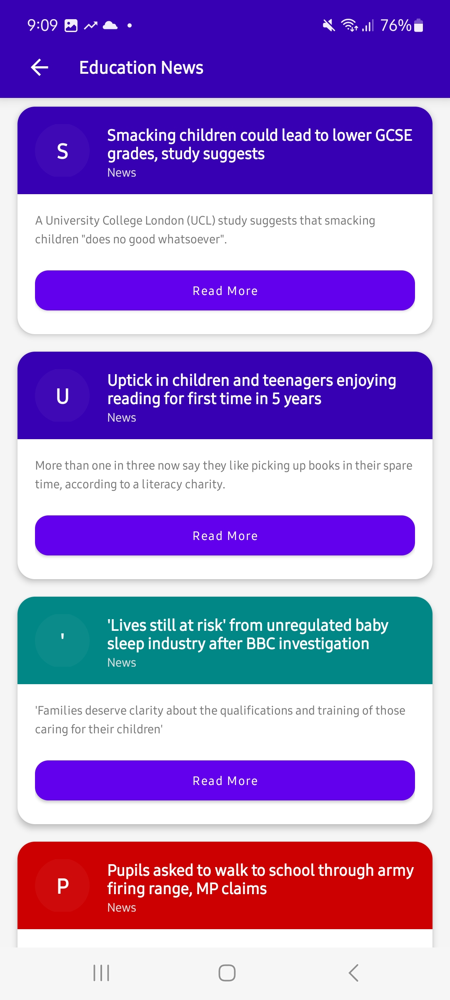 | 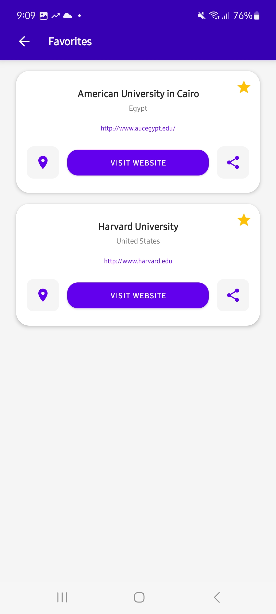 | 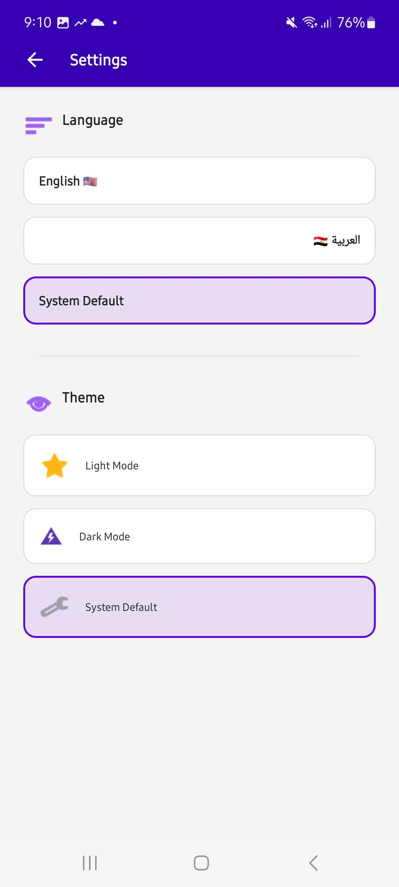 |
| 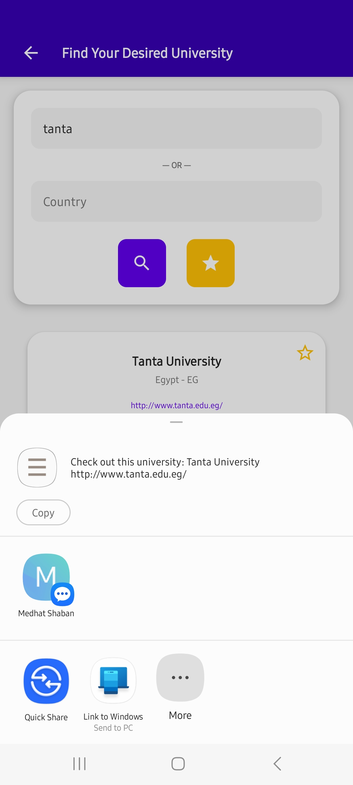 | 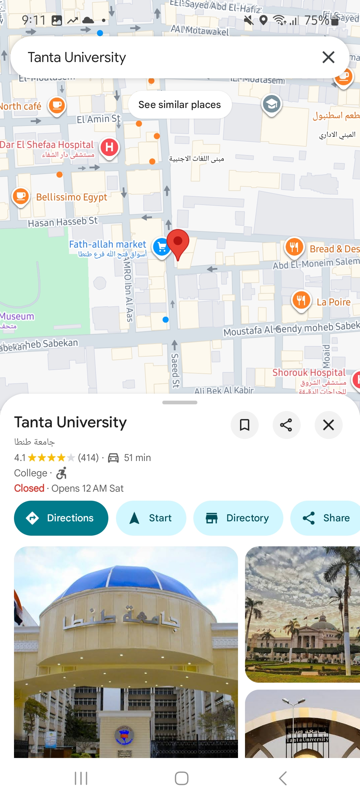 | |

---

## 🛠 Tech Stack & Architecture

This project is built using **Native Android (Java)** following the **MVVM (Model-View-ViewModel)** architecture pattern to ensure separation of concerns, scalability, and testability.

| Technology | Where it is used? | Why it was used? |
| :--- | :--- | :--- |
| **Java** | Entire Application | The core language used for robust Android development. |
| **MVVM Architecture** | Project Structure | To strictly separate UI components from business logic, making the codebase highly maintainable. |
| **Room Database** | Schedule & Favorites | To cache data locally. It provides an abstraction layer over SQLite to allow fluent database access and offline functionality. |
| **Retrofit 2** | University Search | To handle REST API requests efficiently. Chosen for its speed, type safety, and seamless JSON parsing. |
| **OkHttp 3** | AI Modules | Used to manually handle HTTP requests, timeouts, and JSON bodies for communicating directly with the Gemini API. |
| **Google Gemini API** | AI Advisor & Summarizer | To provide intelligent, context-aware conversational responses and process long texts into structured summaries. |
| **LiveData & ViewModel** | UI Updates | To observe data changes dynamically and update the UI without memory leaks (Lifecycle-aware). |
| **Lottie Animations** | Loading & Empty States | To provide a modern, highly engaging user experience during data fetching or when lists are empty. |
| **Material Design** | UI/UX | Extensive use of `CardView`, `RecyclerView`, and custom drawables for a modern, adaptive interface. |

---

## 🚧 Challenges Faced & How We Solved Them

Building a feature-rich application comes with its hurdles. Here are the major challenges overcome during development:

### 1. 🌓 Seamless Dark/Light Mode Integration
* **Challenge:** Hardcoded colors (`#FFFFFF`, `#000000`) caused UI elements to become invisible or visually jarring when switching between system themes.
* **Solution:** Completely overhauled the XML layouts to use dynamic color references (`@color/main_background`, `@color/text_primary`, `@color/accent_color`). This ensured a 100% adaptive UI that looks native and elegant in both Dark and Light modes.

### 2. 🌍 Multi-Language Support (RTL & LTR)
* **Challenge:** Supporting both Arabic (Right-to-Left) and English (Left-to-Right) without breaking the layout alignment.
* **Solution:** Replaced all `layout_marginLeft` and `layout_marginRight` attributes with `marginStart` and `marginEnd`. Extracted all hardcoded text into localized `strings.xml` files, ensuring a flawless switch between languages.

### 3. 🔒 API Key Security for Gemini
* **Challenge:** Pushing the Google Gemini API key directly to GitHub exposes it to security risks and automatic revocation by Google.
* **Solution:** Moved the API key to the `local.properties` file (which is git-ignored) and used the `Secrets Gradle Plugin` / `BuildConfig` to securely inject the key into the app at compile time.

### 4. 📴 Offline Data Persistence with Migrations
* **Challenge:** Adding new features like an "Attendance Tracker" required altering the existing local database structure without crashing the app for existing users.
* **Solution:** Implemented **Room Database** with proper entity updates to save lectures, track absences, and store favorite universities locally, guaranteeing instant access to crucial data regardless of network connectivity.

---

## 💡 Core Features (Modules)

### 1. 🤖 AI Notes Summarizer (New)
* A dedicated tool powered by **Gemini AI** to process lengthy lecture texts or study materials.
* Instantly converts long paragraphs into clear, structured, and easy-to-read bullet points for faster studying.

### 2. 📅 Offline Lecture Schedule & Attendance Tracker
* A complete CRUD module to manage weekly classes (course name, time, professor, room number, and day).
* **Smart Attendance Tracking:** Increment or decrement absences directly from the schedule card, with visual red-color warnings when approaching the absence limit.

### 3. 💬 AI Academic Advisor
* An interactive chat interface where students can seek personalized advice on studying, scholarships, and career paths using AI.
* Modern chat bubble UI mimicking popular messaging apps.

### 4. 🔍 Global University Search
* Live search functionality by university name or country via REST APIs.
* Direct external links to official university websites.
* Ability to save universities to a local "Favorites" list.

### 5. 🎓 Scholarships & GPA Calculator
* **Scholarships Hub:** Browse fully funded global scholarships (e.g., Chevening) with one-click access to more details.
* **Smart GPA Calculator:** Dynamically add courses, credits, and grades to accurately calculate the semester GPA.

---

## 👨‍💻 Developed By

**Eslam Ali**
* 📱 Android Developer
* 📧 Email: eslameng776@gmail.com
* 🔗 GitHub: [Eslamal](https://github.com/Eslamal)

---
*If you find this project useful, don't forget to give it a ⭐ on GitHub!*
